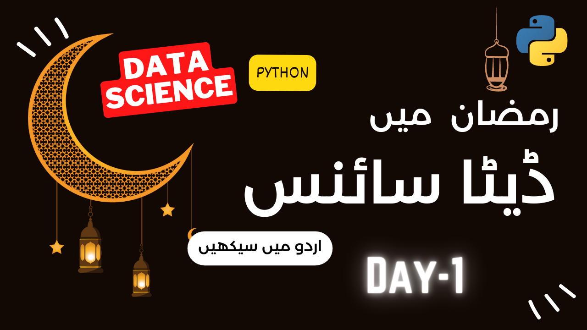
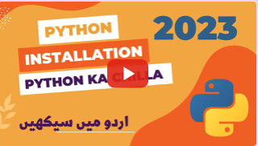
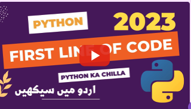
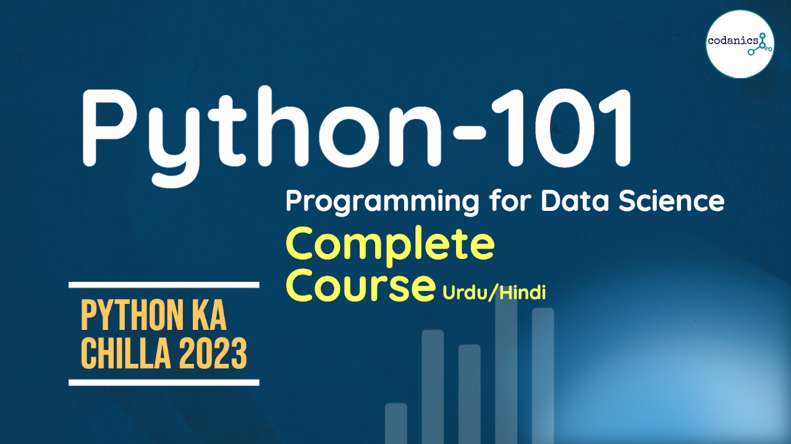
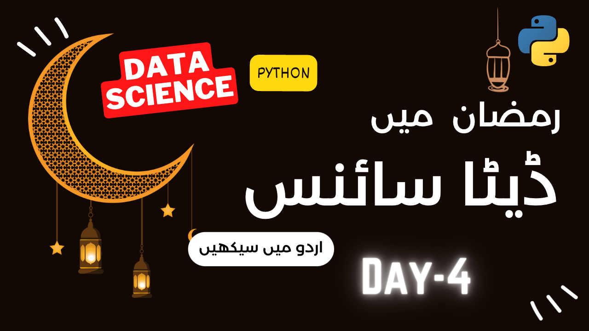
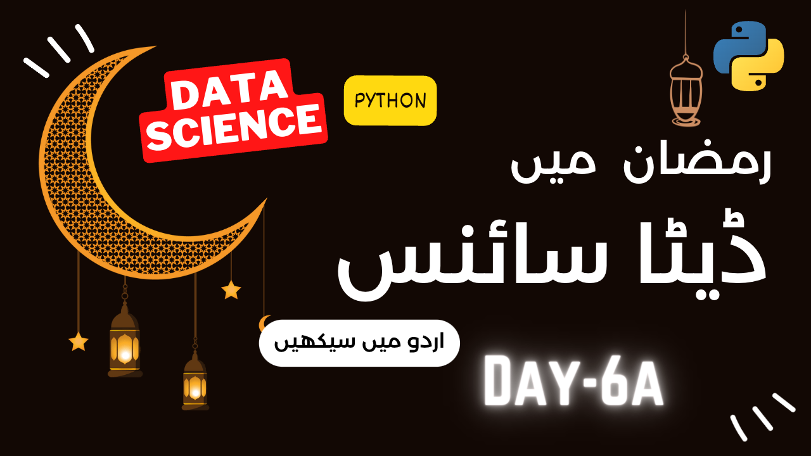
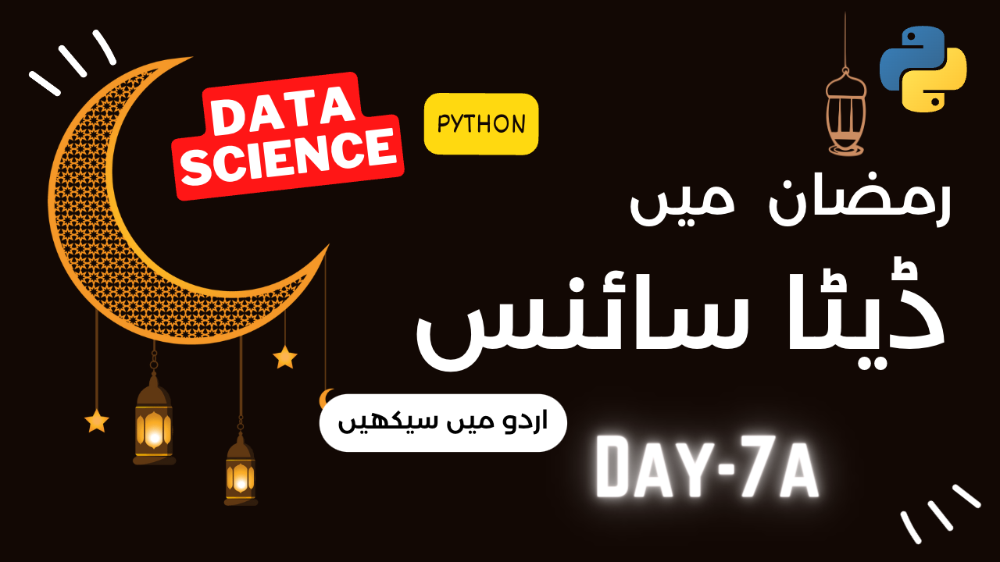

# Ramazan2023-Data Science with Python Batch

## **What will you learn in this course:**

- Introduction to Data Science
- Python Programming
- Mathematics for Data Science
- Statistics for Data Science
- Basic concepts of Data science in Python
- Jupyter Notebooks
- How to find a job in Data Science?
- How to make your social media profile attractive for recruiters?
- Exlporatory Data Analysis
- Baisc to Advance Data Visualization in Python
- Storry telling with Data

## **Who is this course for:**

- Anyone who wants to learn Data Science
- Ap ko urdu bolni ati ho?
- Koi basic knowldge nahi chahyeay hy ap ko Data Science seekhnay k liay
- Ap rozana k 2-3 hours den gay tu acha seekhen gay
- Ap rozana k 3-4 hours den gay tu bht acha seekhen gay
- Follow karen gay hamaray har lecture ko tu aik mah main ap advance level per puhanch jayen gay coding ki In Sha Allah
- No age limit fo this course

## **Resources, Books and Blogs Links:**

- [Python for Data Science- Complete Playlist](https://www.youtube.com/playlist?list=PL9XvIvvVL50Fba7psesg6ynQXdipw-yoN)
- Books:
  - [Python Data Science Handbook](https://jakevdp.github.io/PythonDataScienceHandbook/)
  - [Hands On Machine Learning with Scikit Learn and TensorFlow](https://github.com/yanshengjia/ml-road/blob/master/resources/Hands%20On%20Machine%20Learning%20with%20Scikit%20Learn%20and%20TensorFlow.pdf)
  - [Python for Data Analysis: Data Wrangling with Pandas, NumPy, & jupyter](https://wesmckinney.com/book/)
  - [Python Data Science Handbook](https://jakevdp.github.io/PythonDataScienceHandbook/)
  - [Hands on Exploratory Data analysis with Python](https://github.com/PacktPublishing/Hands-on-Exploratory-Data-Analysis-with-Python)
  - [Data Wranglin in Python](https://github.com/TrainingByPackt/Data-Wrangling-with-Python)

## **Important note:**
Mathematics for Data Science ki ye playlist ap ne regular basis per dekhtay jani hy, rozana ham 2-3 lectures upload karen gay, ye is course ka main hissa hy, [Mathematics with codanics playlist link.](https://youtube.com/playlist?list=PL9XvIvvVL50G3-_NMFreX72zbICK9-NW-)

## 1. **Pehla Roza**

Pehlay lectrue maine ham ne seekha k Python kia hta hy? Data Science kia hta hy? and kis tarah ap Data Science k sath sath apni career bhi bana saktay hain.

Click this image to watch the lecture or here is the lecture [link](https://www.youtube.com/live/RJskNduejxA?feature=share):

## 2. **Dusra Roza**

Dusray lectrue maine ham seekhen gay k Data kia hta hy and also:
- Primary vs. secondary data
- Structured vs. unstructured data
- Data types
  - Categorical vs. numerical
  - Qualitative vs. quantitative
  - Nominative vs. ordinal
  - Discrete vs. continuous

## 3. **Teesra Roza**

> ### **Installation of Python and VScode**
> 
> Python ko seekhnay se pehlay usay install karna zaroori hy or yahan ham 2 software install karen gay:\
>       1. Python form [this link](https://www.python.org/downloads/)\
>       2. VScode (Vidual Studio Code) from [this link](https://code.visualstudio.com/)\

Urdu main ham ne in software ko install krne ka tareeqa bhi bta dea hy, neechay image per click kar k video dekh saktay hyn. 

> ### **Write your first line of code with us**
> Is video main hame dekhen gay k ap ne installation k baad first line of code kaisay likhni hy
> 
> Lecture ko Urdu video main sunnay k liay is imagae per click karen
>

Python Programming (Python-101) by clicking on this:\

## 4. **Chautha Roza**

Revise this lecture and finish this asap.\
Python Programming (Python-101) by clicking on this:\

Click here to watch the lecture:\

## 5. **5th Roza**

> ### **ABC of Statistics (Part-1)**

Click here to watch the lecture:\

> ### **ABC of Statistics (Part-2)**

Click here to watch the lecture:\

> ### **ABC of Statistics (Part-3)**

Click here to watch the lecture:\

## 6. **6th Roza**

> ### **ABC of Statistics (Part-4)**

Click here to watch the lecture:\

> ### **ABC of Statistics (Part-5)**

Click here to watch the lecture:\

> ### **ABC of Statistics (Part-6)**

Click here to watch the lecture:\

## 7. **7th Roza**
> ### **ABC of Statistics (Part-7)**

Click here to watch the lecture:\

> ### **ABC of Statistics (Part-8)**

Click here to watch the lecture:\

## 8. **8th Roza**

> ### **Data Loading in Python to Data Visualization**

Click here to watch the lecture:\

